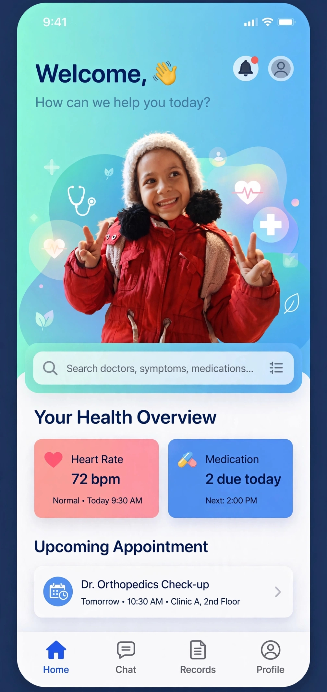

# Repository-name-estashir-tabibak-Description---Hamd-Sakr-Public-Add-a-README-file
تطبيق استشارات طبيقه وتقديم  نصائح وتحليل شكوى المريض، كما يمكن قراءة التحاليل الطبيه والاشاعات ورسم القلب 
<!DOCTYPE html>
<html lang="ar" dir="rtl">
<head>
<meta charset="UTF-8">
<meta name="viewport" content="width=device-width, initial-scale=1.0">
<title>استشير طبيبك</title>

</head>
<body>

<h2>أهلاً بيك في استشير طبيبك 👩‍⚕️</h2>

برعاية حمد صقر - رعاية صحية موثوقة

<button class="btn" onclick="Pi.authenticate(['username'], a=>alert('أهلاً '+a.user.username))">🔐 تسجيل دخول بـ Pi</button>
<button class="btn btn2" onclick="alert('جاهز! ارفع التحليل')">🩺 ابدأ الاستشارة</button>

تنبيه: المحتوى تثقيفي فقط وليس تشخيص طبي

</body>
</html>
